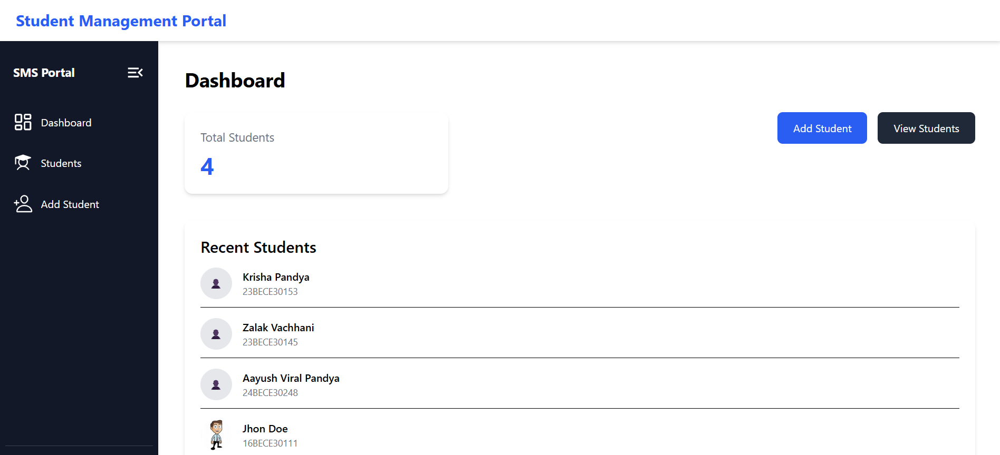
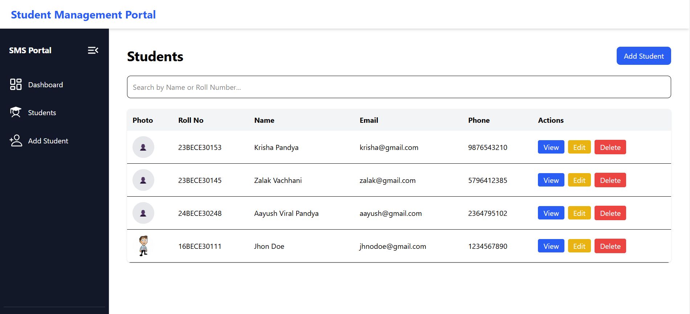
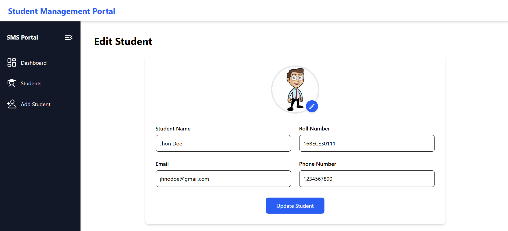

# 🎓 Student Management Portal

A full-stack MERN application for managing student records with image upload support. The portal allows teachers to add, view, update, delete, and search student information through an intuitive dashboard interface.

---

## 🚀 Features

### 👨‍🎓 Student Management

- Add new students
- View all students
- Edit student details
- Delete student records
- Search students by Name or Roll Number

### 🖼️ Student Photo Upload

- Upload student profile photos
- Cloudinary integration for image storage
- Image preview before upload
- Automatic image URL storage in MongoDB

### 📊 Dashboard

- Total student count
- Recent students overview
- Quick navigation actions

### 🎨 User Interface

- Responsive design
- Collapsible sidebar
- Modern dashboard layout
- Clean and intuitive UI
- React Router based navigation

---

## 🛠️ Tech Stack

### Frontend

- React.js
- React Router
- Axios
- Tailwind CSS
- React Icons

### Backend

- Node.js
- Express.js
- Multer
- Cloudinary

### Database

- MongoDB
- Mongoose

---

## 📁 Project Structure

```bash
Student-Management-Portal/
│
├── frontend/
│   ├── src/
│   │   ├── components/
│   │   │   ├── student/
│   │   │   │   ├── StudentForm.jsx
│   │   │   │   ├── StudentTable.jsx
│   │   │   │   ├── StudentRow.jsx
│   │   │   │   └── SearchBar.jsx
│   │   │
│   │   ├── pages/
│   │   │   ├── Dashboard.jsx
│   │   │   ├── Students.jsx
│   │   │   ├── AddStudent.jsx
│   │   │   └── EditStudent.jsx
│   │   │
│   │   ├── components/
│   │   │   ├── Navbar.jsx
│   │   │   └── Sidebar.jsx
│   │   │
│   │   └── App.jsx
│   │
│   └── package.json
│
├── backend/
│   ├── config/
│   │   ├── db.js
│   │   └── cloudinary.js
│   │
│   ├── middleware/
│   │   └── upload.js
│   │
│   ├── models/
│   │   └── Students.js
│   │
│   ├── .env
│   ├── server.js
│   └── package.json
│
└── README.md
```

---

## ✨ Screenshots

### Dashboard



### Students Page



### Add Student


### Edit Student



---

## ⚙️ Backend Setup

```bash
cd backend
npm install
```

Create a `.env` file:

```env
MONGO_URI=your_mongodb_connection_string

CLOUDINARY_CLOUD_NAME=your_cloud_name
CLOUDINARY_API_KEY=your_api_key
CLOUDINARY_API_SECRET=your_api_secret
```

Run Backend:

```bash
npm run dev
```

Backend Server:

```bash
http://localhost:5000
```

---

## 💻 Frontend Setup

```bash
cd frontend
npm install
npm run dev
```

Frontend Server:

```bash
http://localhost:5173
```

---

## 🔗 API Endpoints

### Students API

| Method | Endpoint        | Description       |
| ------ | --------------- | ----------------- |
| GET    | `/students`     | Get all students  |
| GET    | `/students/:id` | Get student by ID |
| POST   | `/students`     | Create student    |
| PUT    | `/students/:id` | Update student    |
| DELETE | `/students/:id` | Delete student    |

### Upload API

| Method | Endpoint  | Description          |
| ------ | --------- | -------------------- |
| POST   | `/upload` | Upload student image |

---

## 🗄️ Student Schema

```javascript
{
  name: String,
  rollNo: String,
  email: String,
  phone: String,
  photo: String
}
```

---

## 🎯 Key Features Implemented

✅ Create Student

✅ View Students

✅ Update Student

✅ Delete Student

✅ Search Students

✅ Upload Student Photos

✅ Cloudinary Integration

✅ MongoDB Integration

✅ REST API Development

✅ Responsive UI Design

---

## 📚 Concepts Learned

This project helped in understanding:

- React Components
- React Router
- State Management using Hooks
- Axios API Calls
- Express.js REST APIs
- MongoDB CRUD Operations
- Mongoose ODM
- Middleware in Express
- File Uploads using Multer
- Cloudinary Integration
- Full Stack MERN Development

---

## 🚀 Future Enhancements

- Parent Information
- Guardian Information
- Student Authentication
- Attendance Management
- Report Generation
- Data Export (PDF/Excel)
- Dark Mode
- Dashboard Analytics
- Deployment on Vercel & Render

---

## 👩‍💻 Author

### Pandya Krisha Viral

B.Tech Computer Engineering Student

Built as a hands-on MERN Stack project to learn:

- Frontend Development
- Backend Development
- Database Integration
- REST APIs
- Cloud Storage
- Full Stack Application Development

---

## ⭐ Show Your Support

If you like this project, give it a ⭐ on GitHub!

Happy Coding 🚀
